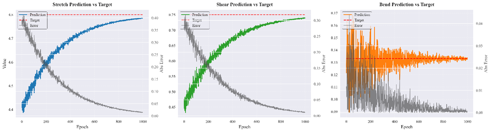
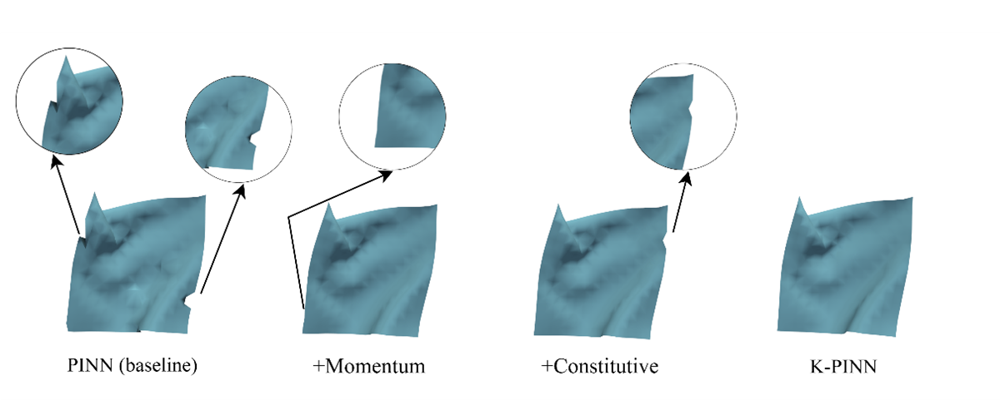
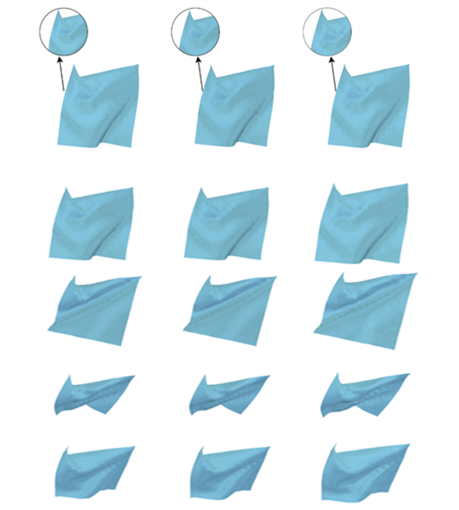
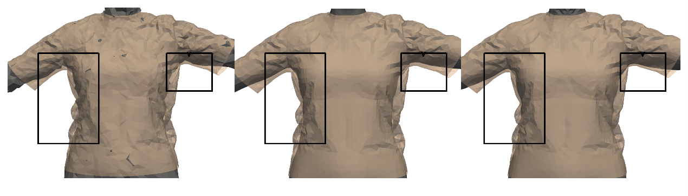

# Cloth-Simulation
# Physics-Informed Neural Networks for High-Fidelity Dynamic Cloth Simulation: Parameter Estimation and Differentiable Simulation

This repository provides an implementation of a **dual-driven physics-informed neural network (PINN)** framework for accurate dynamic cloth simulation. The approach integrates physical modeling with data-driven learning, achieving precise parameter estimation and high-fidelity simulations for cloth behavior. The framework consists of two key components:

### Key Contributions:
- **K-PINN**: Reduces density estimation error from 1.8% to 1.2% compared to existing methods.
- **DP-PINN**: Outperforms traditional physics-based methods and data-driven models in simulation speed (6.1 ms for two-point fixed cloth) and physical consistency, providing stable and realistic dynamic cloth behaviors.

---

## Key Features

- **High-Fidelity Simulation**: Achieves real-time and accurate cloth simulation with complex deformations like stretching, bending, and wrinkling.
- **Dual-Driven Framework**: Combines physics-based modeling and data-driven learning, offering both simulation accuracy and computational efficiency.
- **Differentiable Physics Engine**: Enables seamless optimization of physical parameters and network weights through backpropagation.
- **Realistic Cloth Deformations**: Suitable for virtual reality, digital humans, and virtual try-on applications.

---


 ## Installation
To install the dependencies, run:
```bash
pip install -r requirements.txt
```
## Training
1. Find the path to the training script.

```text
ncs/train.py/
```bash
python main.py
```


## training epochs
**Stretch parameter prediction and error variation (left), shear parameter prediction and error variation (center), bend parameter prediction and error variation (right).**



## Simulation Results
**Results of ablation experiment.**



**Detail comparison of ribbed fabric simulation results using Physics-Based, MGN, and DPPINN methods from left to right.**



**From left to right are the comparison results of clothing simulation details using the physical method, the MGN method, and the DP-PINN model.**

